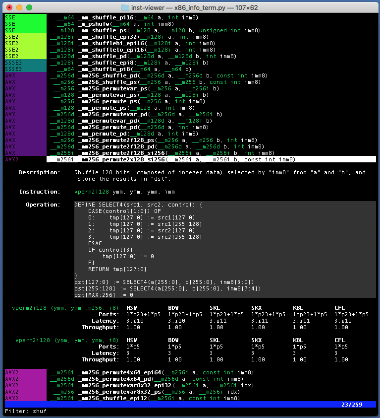

x86-info-term
===
x86-info-term is a curses-based viewer for x86 instruction info built with
Python 3. It combines the following data sources:
* Intrinsics from the [Intel Intrinsics Guide](https://software.intel.com/sites/landingpage/IntrinsicsGuide/).
* Performance info from [uops.info](https://uops.info).

Details
===

Right now, performance information is joined to the intrinsics in an imperfect
way: the performance info for all instruction variants that match one of the
instructions listed in the Intrinsics guide are shown. This means that sometimes
spurious instructions are shown, suchs as showing both loads and stores under
a load intrinsic, or showing instruction variants with the wrong vector sizes.
Normalizing the instruction operand formats used by the Intrinsics Guide and uops.info
to fix this is rather tricky, and for now I have opted for showing extraneous
data rather than not showing possibly relevant data.

Basic vim keybindings are supported. See the source for more details--no documentation yet!
